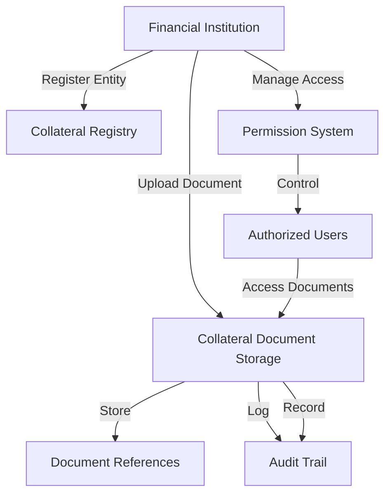

# Collateral Utility

A decentralized document management and collateralization system built on the Stacks blockchain, enabling secure tracking, access control, and audit logging for financial collateral documents.

## Overview

Collateral Utility provides financial institutions and businesses with a robust, transparent solution for managing collateral documentation. The system offers:

- Secure entity registration
- Document reference storage
- Granular access control
- Comprehensive audit logging
- Versioned document tracking

## Architecture

The system is built around a smart contract that manages document references, access permissions, and provides an immutable audit trail for collateral-related documents.



### Core Components

1. **Collateral Registry**: Stores entity information and ownership
2. **Document Storage**: Manages document metadata and references
3. **Permission System**: Controls document access rights
4. **Audit System**: Tracks all document interactions

## Contract Documentation

### Permission Levels

- `PERMISSION-NONE (u0)`: No access
- `PERMISSION-VIEW (u1)`: View-only access
- `PERMISSION-MANAGE (u2)`: Can modify document details
- `PERMISSION-ADMIN (u3)`: Can manage document permissions
- `PERMISSION-OWNER (u4)`: Full control

### Action Types

- `ACTION-CREATE (u1)`: Document registration
- `ACTION-VIEW (u2)`: Document access
- `ACTION-UPDATE (u3)`: Document modification
- `ACTION-SHARE (u4)`: Permission changes
- `ACTION-DELETE (u5)`: Document deletion

## Getting Started

### Prerequisites

- Clarinet
- Stacks wallet
- Node.js environment

### Basic Usage

1. Register a collateral entity:
```clarity
(contract-call? .collateral_utility register-entity "entity123" "ACME Financial")
```

2. Add a collateral document:
```clarity
(contract-call? .collateral_utility add-document 
    "entity123" 
    "doc123" 
    "Property Deed" 
    "Commercial real estate collateral" 
    0x1234... 
    "real-estate")
```

3. Grant access:
```clarity
(contract-call? .collateral_utility grant-document-permission 
    "entity123" 
    "doc123" 
    'ST1PQHQKV0RJXZFY1DGX8MNSNYVE3VGZJSRTPGZGM 
    u1)
```

## Function Reference

### Entity Management

```clarity
(register-entity (entity-id (string-ascii 64)) (name (string-ascii 256)))
```
Registers a new entity in the system.

### Document Management

```clarity
(add-document 
    (entity-id (string-ascii 64))
    (document-id (string-ascii 64))
    (name (string-ascii 256))
    (description (string-utf8 500))
    (document-hash (buff 32))
    (document-type (string-ascii 64)))
```
Adds a new document for collateral tracking.

### Access Control

```clarity
(grant-document-permission 
    (entity-id (string-ascii 64))
    (document-id (string-ascii 64))
    (user principal)
    (permission-level uint))
```
Grants access permissions to a user.

## Development

### Testing

1. Clone the repository
2. Install dependencies
3. Run tests:
```bash
clarinet test
```

### Local Development

1. Start Clarinet console:
```bash
clarinet console
```

2. Deploy contract:
```bash
clarinet deploy
```

## Security Considerations

### Access Control
- Only entity owners can register new documents
- Permission levels are strictly enforced
- All access attempts are logged
- Document owners have full control

### Data Privacy
- Only document references are stored on-chain
- Actual documents should be stored off-chain in encrypted form
- Access control is managed through permission levels
- Audit trail maintains accountability

### Limitations
- Document hashes must be managed securely off-chain
- Permission changes require admin access
- No document content encryption on-chain
- Limited to 64-character entity and document IDs

## License

[Add appropriate license information]